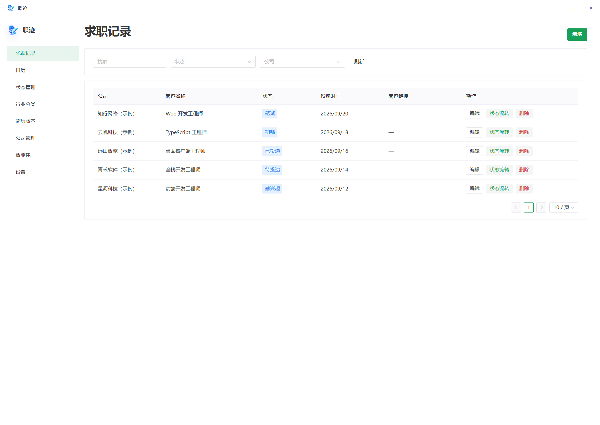
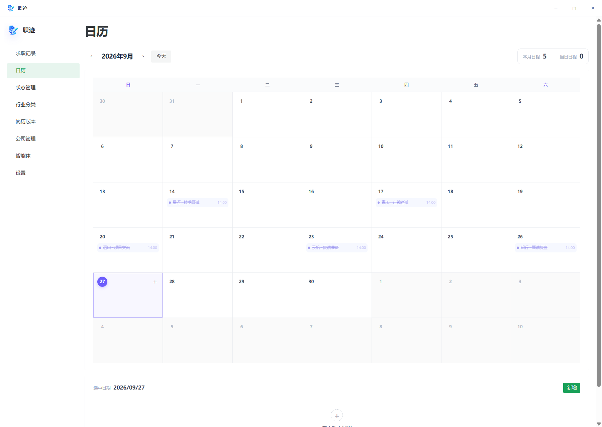
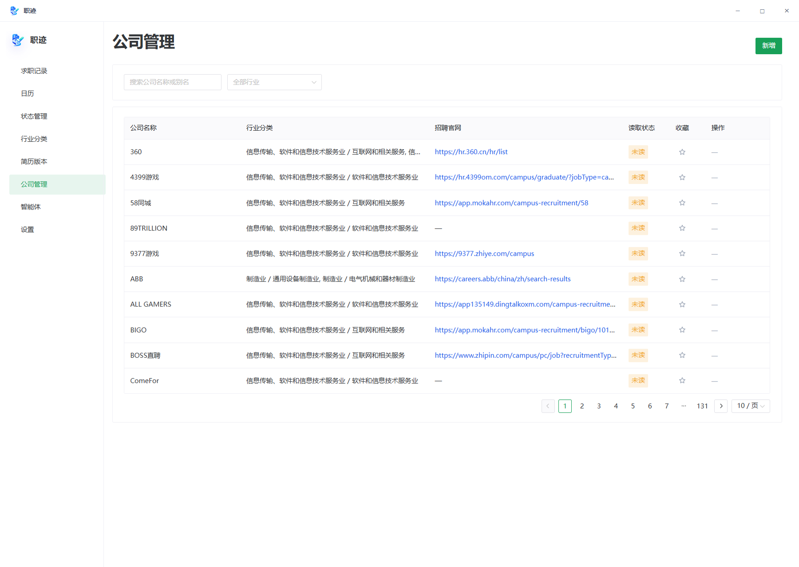
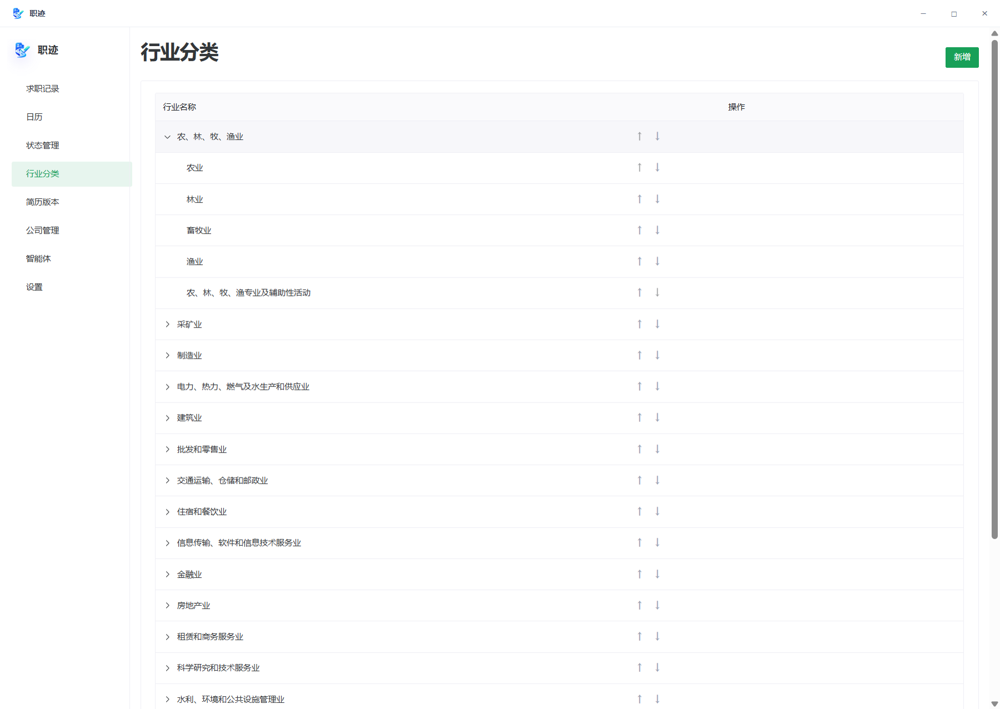
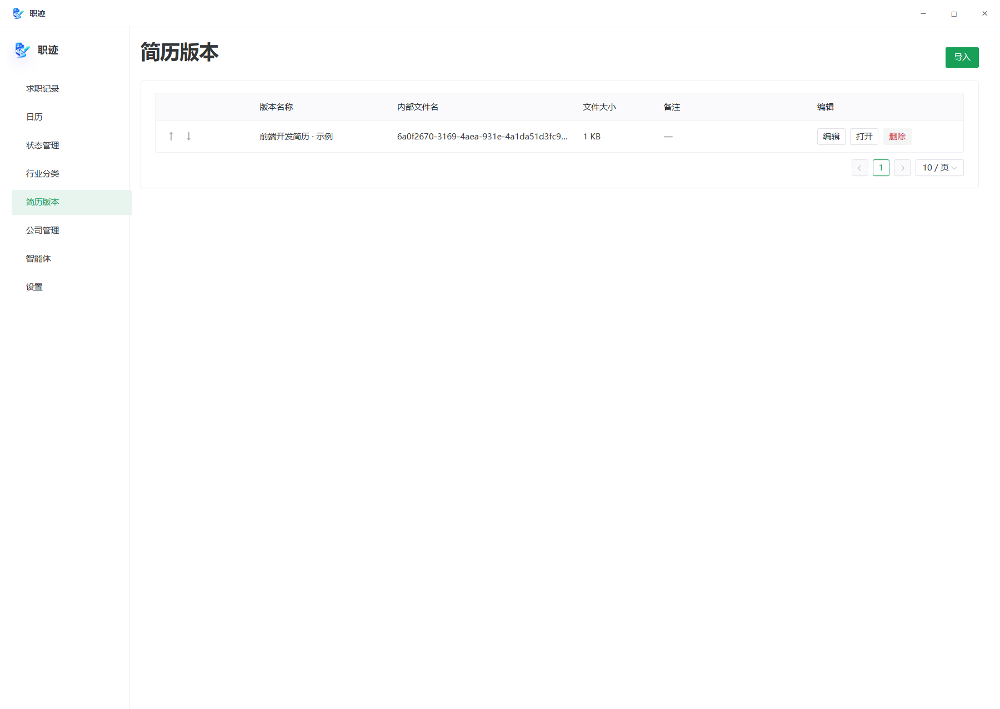
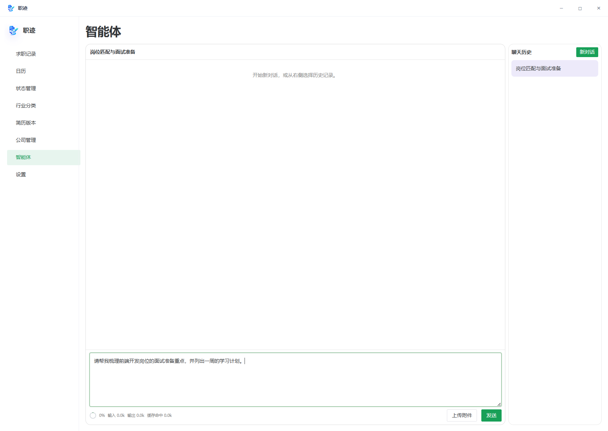

# JobTrail

[简体中文](README.md) | **English**

JobTrail is a local desktop app for managing your job search on Windows. Keep companies, job opportunities, resumes, application progress, and interview schedules in one place.

## Features

- **Job discovery (Beta)**: Search BOSS, Liepin, Zhilian and 51job, filter salaries, browse stable result pages, read job details, open embedded websites and save selected jobs. Supports search history and MCP. See the [job discovery specification](docs/job-discovery.md) for search rules, account management and API contracts.
- **Application tracking**: Organize job details and application progress, with links to resumes and scheduled events.
- **Company management**: Find companies, browse career websites, manage multiple office locations, combine industry and location filters, and save favorites.
- **Resume management**: Keep multiple resumes and track which one you used for each application.
- **Calendar and reminders**: Schedule interviews, assessments, and deadlines with local notifications.
- **AI assistant**: Connect a model of your choice to discuss resumes and job opportunities, or connect external AI tools through MCP.
- **Data backup**: Export and import complete backups of your records, settings, resumes, and chat attachments.

Supports Simplified Chinese and English, light and dark themes, the system tray, launch at startup, and in-app updates.

## Tech stack

| Area               | Technologies                                          | Role                                                               |
| ------------------ | ----------------------------------------------------- | ------------------------------------------------------------------ |
| Desktop app        | Electron, TypeScript                                  | Main process, preload scripts, and Windows desktop integration     |
| User interface     | Vue 3, Naive UI, Pinia, Vue I18n                      | Views, components, state management, and localization              |
| Local data         | SQLite, better-sqlite3                                | Store applications and app data on the device                      |
| AI agent and tools | LangChain, LangGraph, MCP SDK                         | Agent workflows and external tool connections                      |
| Web access         | Playwright                                            | Browse company career pages and retrieve information               |
| Build and release  | electron-vite, Vite, electron-builder, Velopack, Rust | Build the app and handle Windows installation, launch, and updates |
| Testing            | Vitest, Node.js test runner, Playwright               | Unit tests and packaged desktop app tests                          |

## Screenshots

The screenshots show the Chinese interface with sample applications, events, and resumes. Click an image to view it at full size.

| Application tracking                                                                            | Calendar                                                                                   |
| ----------------------------------------------------------------------------------------------- | ------------------------------------------------------------------------------------------ |
| [](docs/screenshots/applications.png) | [](docs/screenshots/calendar.png)                |
| Company management                                                                              | Industry categories                                                                        |
| [](docs/screenshots/companies.png)         | [](docs/screenshots/industries.png) |
| Resume versions                                                                                 | AI assistant                                                                               |
| [](docs/screenshots/resumes.png)                | [](docs/screenshots/assistant.png)          |

## Download and get started

Download the Windows installer from [GitHub Releases](https://github.com/baozha2023/JobTrail/releases) and follow the prompts to install into an empty folder.

You can start managing applications right away. To use the AI assistant, enter your model service URL, model name, and API key in Settings. To connect an external AI tool, copy the corresponding MCP configuration from Settings. MCP is enabled by default and can be turned off in Settings.

Job discovery only enables platforms with a confirmed login. Login and expired-session prompts open the QR panel; website-verification prompts open a separate site window. After QR confirmation or the user closes the verification window, JobTrail checks the original query and resumes that platform when the check succeeds.

Live discovery tools reuse an already running JobTrail client from the same installation. If none is running, MCP starts it in the system tray without taking focus. Local history queries do not require the desktop to run.

Dynamic web reading uses the installed **Microsoft Edge Stable**; the installer does not include a separate Playwright Chromium browser. Install Edge and keep it updated. If Edge cannot start, JobTrail reports the problem; local features and static web reading remain available. Automatic mode may return static content with an incomplete-result warning.

Job discovery pages use Electron's embedded Chromium.

Job discovery supports direct connections and system HTTP/HTTPS proxies. SOCKS, authenticated proxies, and proxies that reject IP-based CONNECT are unsupported; failures never fall back to a direct connection. See the [discovery specification](docs/job-discovery.md) for network boundaries and validation limits.

Local reminders require the app to remain running. You can hide the window in the system tray.

## Data and privacy

JobTrail requires no application account and does not provide cloud sync. Application records, resumes, and chat history are stored locally. When you use the AI assistant, relevant conversations and selected content are sent to the model service you configure.

Recruitment-platform login sessions stay in the local browser profiles and are excluded from portable backups.

Export a complete backup from Settings and save it outside the installation folder. **Importing replaces your current data, and uninstalling clears the installation folder. Back up your data first.**

## Local development

Set up Windows, Node.js, pnpm, and Microsoft Edge Stable, then follow the [configuration guide](CLAUDE.md) (in Chinese) to create a local `private-build.config.json`. Do not commit this file to Git. Keep the original build key when working with existing data.

```powershell
pnpm install --frozen-lockfile
pnpm dev
```

Common commands:

| Command             | Purpose                     |
| ------------------- | --------------------------- |
| `pnpm typecheck`    | Check types                 |
| `pnpm test`         | Run tests                   |
| `pnpm format:check` | Check formatting            |
| `pnpm build`        | Build the app               |
| `pnpm release:win`  | Build the Windows installer |

Building the installer also requires Rust with the MSVC toolchain, Visual Studio C++ Build Tools, the .NET SDK, and the Velopack CLI. See the [development guidelines](CLAUDE.md) (in Chinese) for development and release conventions.

## Project documentation

The following documents are in Chinese:

- [Development guidelines](CLAUDE.md)
- [Job discovery](docs/job-discovery.md)
- [Database structure](docs/database.md)
- [Persistence upgrades](docs/persistence-upgrade-guide.md)
- [Diagnostics](docs/diagnostics.md)
- [Scripts and acceptance tests](scripts/README.md)

## License

[MIT License](LICENSE)
